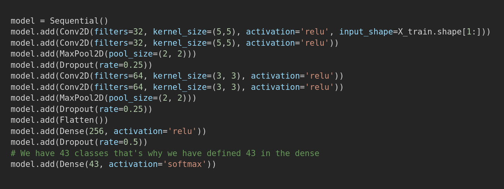

# Traffic-Signs-Deep-Learning-Classification
Used Tensorflow and Keras for the deep learning model
------------------------------------------------------

used the german traffic sign datset from kaggle:
    https://www.kaggle.com/meowmeowmeowmeowmeow/gtsrb-german-traffic-sign
    
    model architecture:

    
    
